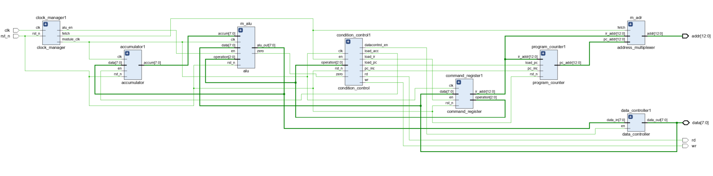

# Simple_RISC
* **这个是夏宇闻 Verilog 数字系统设计教程简化的 RISC_CPU 设计的内容。**
## RISC_CPU 的组成
* 顶层文件：risc_cpu.v。
* 时钟发生器：clock_manager.v。
* 指令寄存器：command_register.v。
* 累加器：accumulator.v。
* 算术逻辑运算单元：alu.v。
* 数据控制器：data_controller.v。
* 状态控制器：condition_control.v。
* 程序计数器：program_counter.v。
* 地址多路器：address_multiplexer.v。

## RISC_CPU 的测试外围部件
* 指令寄存器：rom_test.v。
* 数据寄存器：ram_test.v。
* 地址译码器：addr_decode.v。
## RISC_CPU 的指令系统
### 指令格式
[15:13] 为指令，[12:0] 为地址，总共 16 位。RISC_CPU 是 8 位微处理器，一律采用直接寻址方式，即数据总是放在存储器中，寻址单元的地址由指令直接给出。
### 指令
它的指令系统仅由8条指令组成。
* HLT：停机操作。该操作将空一个指令周期，即8个时钟周期。
* SKZ：若为零跳过下一条语句。该操作先判断当前alu中的结果是否为零，若是零就跳过下一条语句，否则继续执行。
* ADD相加。该操作将累加器中的值与地址所指的存储器或端口的数据相加，结果仍送回累加器中。
* AND相与。该操作将累加器的值与地址所指的存储器或端口的数据相与，结果仍送回累加器中。
* XOR异或。该操作将累加器的值与指令中给出地址的数据异或，结果仍送回累加器中。
* LDA读数据。该操作将指令中给出地址的数据放入累加器。
* STO写数据。该操作将累加器的数据放人指令中给出的地址。
* JMP无条件跳转语句。该操作将跳转至指令给出的目的地址，继续执行。

